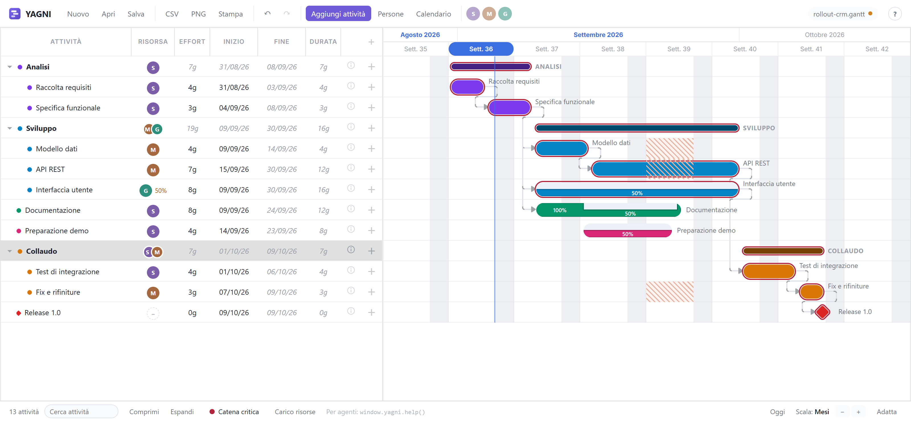
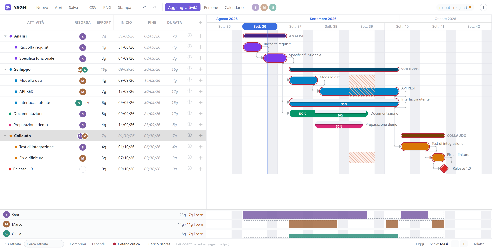

<div align="center">

# YAGNI

**Yet Another Gantt, Now Improved**

*The Gantt chart that knows people can't do two things at once.*

[](https://github.com/okon3/yagni/actions/workflows/deploy.yml)

**[Try it live](https://okon3.github.io/yagni/)** — no install, no account, no backend.



</div>

## Why another Gantt?

In every other Gantt tool, *you* type the end dates and the tool draws rectangles.
Assign two tasks to the same person, and it happily shows them both full speed,
in parallel, finishing on time. Reality disagrees.

YAGNI flips the model: **effort and start date are inputs; the end date is always
computed.** A discrete-event scheduler simulates your team. When two tasks overlap
on the same person, each runs at 50% and stretches accordingly — three tasks, 33%
each. Move one task and everything sharing its people re-flows. You cannot draw a
plan that your team can't actually execute.

## Features

**Capacity-splitting scheduler** — the engine divides each person's capacity
between whatever overlaps on them. Bars show the live allocation profile: a task
running alone at 100%, dropping to 50% when a second one starts, climbing back
when it ends. Contention is visibly different from part-time work, so you know
whether to *reassign the task* or *change the person*.

**A critical chain that is measured, not assumed** — classic CPM is wrong here,
not approximate: a task can set the end date with no dependency on it at all,
just by sharing a person with something that does. So YAGNI perturbs the plan and
re-solves it, task by task, and reports real float and real criticality — with
the person that causes the contention named on the tooltip.

**People, part-time, and holidays** — per-person availability (50%, 80%, anything),
availability periods, absences, and company shutdowns. The time axis is working
minutes: nights and weekends simply don't exist, so durations never lie.

**Resource load lanes** — one lane per person under the chart, on the same time
axis: a dashed ceiling for what they have, a solid band for what the plan booked,
and the gap between them is your free capacity. Over-allocation can't happen by
construction — idle capacity is what you go looking for.



**Milestones for free** — a task with zero effort *is* a milestone: a diamond on
the date the plan reaches, cascading into whatever depends on it, consuming
nobody's time. One concept, not two.

**Everything is undoable** — whole-project snapshots on every edit, restored with
the viewport intact. Unsaved work survives a closed tab and is offered back on
return. Search that marks and walks matches without ever filtering your plan out
from under you.

**Your files, your machine** — projects are plain-JSON `.gantt` files that the
browser downloads and reads back. Strict parsing: a malformed file is refused, it
never corrupts the open plan. Export the solved schedule as CSV, a self-scaling
PNG, or print/PDF with proper pagination.

**Built for AI agents** — the whole app is scriptable through `window.yagni`, in
production too. Every button has an API equivalent, errors throw, and the docs
are served at [`/llms.txt`](https://okon3.github.io/yagni/llms.txt):

```js
yagni.help();                                    // the whole surface, as Markdown
const id = yagni.addTask({ name: 'Analisi', nominalDays: 5, resourceId: 'r1' });
yagni.getPlan().tasks;                           // the solved schedule, tree order
yagni.getCriticalChain();                        // measured float per task
yagni.getResourceLoad();                         // the same plan, per person
```

The `.gantt` file itself is agent-friendly: alongside the inputs it embeds a
`solved` report — computed dates, elapsed days, contention flags — so an agent
reading the file without the app still sees the schedule.

## Quick start

Use the [live version](https://okon3.github.io/yagni/), or run it yourself:

```bash
git clone https://github.com/okon3/yagni.git
cd yagni
npm install
npm run dev        # http://localhost:5173
```

`npm run build:single` produces a **single self-contained HTML file** — the whole
app in one artifact you can email, drop on a share, or open from disk.

## How it works

| Document | Contents |
| --- | --- |
| [docs/scheduling.md](docs/scheduling.md) | The scheduling model: the simulation, measured float, availability, milestones |
| [docs/view.md](docs/view.md) | The UI and the reasoning behind it |
| [docs/file-format.md](docs/file-format.md) | The `.gantt` format, CSV/PNG/print export |
| [src/gantt/agentApi.help.md](src/gantt/agentApi.help.md) | The agent API reference (`yagni.help()` / `/llms.txt`) |

The engine (`src/scheduler`) is framework-free, fully unit-tested TypeScript with
no UI imports; the view wraps [dhtmlx-gantt](https://dhtmlx.com/docs/products/dhtmlxGantt/)
Community (MIT) for rendering only, and could be replaced without touching the
scheduling semantics.

## Not implemented (yet)

CSV/Excel import, several resources on one task, per-task fixed or capped
allocation. The name is a promise: nothing lands before it earns its place.
